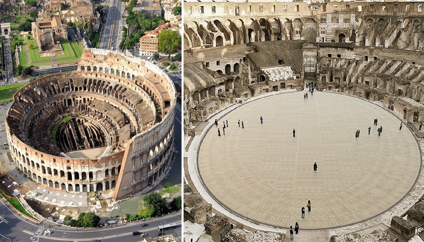
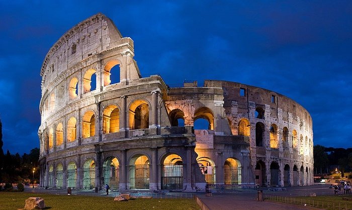
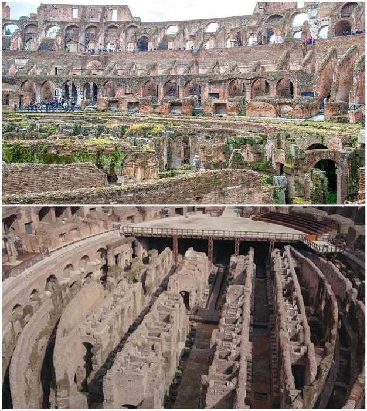
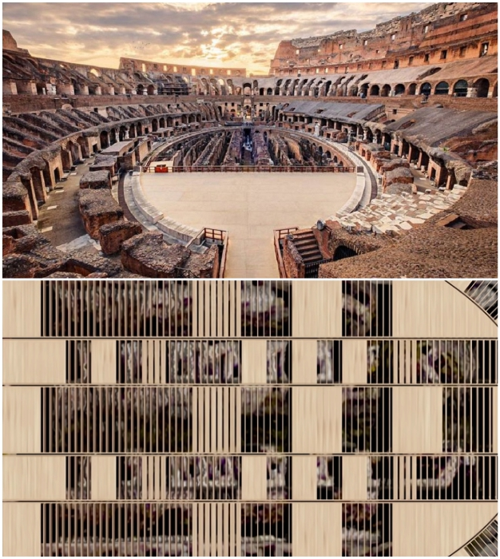

# The Colosseum's iconic arena is to be restored using innovative technology

One of the ancient creations of the architects of genius of Ancient Rome, the Colosseum will try to return to its former glory, with a modern twist. The Ministry of Culture of Italy announced that the engineering company Milan Ingegneria can already start restoration works. The highlight of the transformation will be a wooden mobile platform covering the entire main floor of the arena, which will allow visitors to walk on it, as gladiators once did, and it is planned to hold public events there.

Since the 80s of the Roman era the Colosseum was the place to hold spectacular events - from bloody gladiatorial fights and animal harassment, to show sea battles (namaachia), which attracted over 50 thousand people. Despite the fact that so many years have passed since then, the dilapidated arena attracts millions of tourists eager to see the impressive object with their own eyes.

According to the authors: interest in visiting the Colosseum increased in the XIX century, when archaeologists discovered under the wooden flooring of the arena network of underground tunnels and chambers, which at one time contained gladiators and animals before the bloody battles. It was then that the decision was made to dismantle the platform so that tourists and everyone else could freely view the rooms hidden from the public. Since then, some of the underground tunnels could be seen simply by standing on the preserved bleachers.

``A bit of history: Construction of the Colosseum or Flavius Amphitheater began in 72 AD. It took only eight years to erect such a grandiose facility using a minimum of construction equipment. Researchers argue that the main driving force in the construction of the open-air theater were slaves brought after the military campaigns in Judea (it is assumed that there were about 100,000 of them), and the calculations and management were done by local craftsmen, architects, engineers and artists. In such a short period of time the whole army of builders and slaves managed to erect one of the most impressive constructions in the world. According to calculations, the length of the outer ellipse of the amphitheater is 524 m, with an arena length of 85.75 m and a width of 53.62 m. The height of the walls varies from 48 to 50 m.``

As promised by the Minister of Culture Dario Franceschini, this should change by 2023, as it was decided to restore the wooden platform. The engineering company Milan Ingegneria undertook a special restoration using innovative technologies. According to preliminary calculations of the company, the reconstruction and renovation of the arena will require about $ 22 million.

"It will be a great technological intervention, which will allow visitors to see not only the underground rooms, but also to appreciate the beauty of the Colosseum, standing in the center of the arena", - on this occasion says the Italian Minister of Culture.

